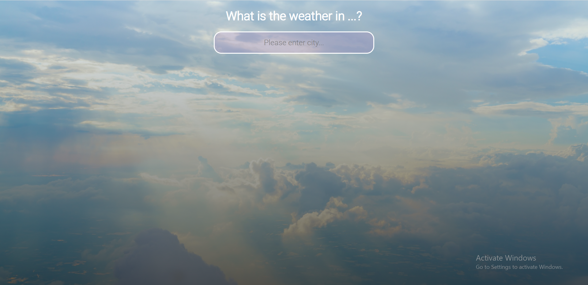

# Weather App

This is a simple web application that allows users to check the weather for a specific city.

## Table of Contents

- [Features](#features)
- [Check out](#check-out)
- [Technologies Used](#technologies-used)
- [Usage](#usage)

## Features

- Input a city name and get the current weather information.
- Displays temperature, feels like temperature, weather conditions, and date.
- Uses external libraries like GSAP for animations.
- Responsive design.

## Check out

You can check out app [here](https://little-efficacious-saffron.glitch.me/).

## Technologies Used

- HTML5
- CSS3
- JavaScript
- GSAP (GreenSock Animation Platform)
- [OpenWeather API](https://openweathermap.org/api) for weather data

## Usage

- Enter a city name in the input field, and press Enter.
- The app will fetch and display the current weather information for that city.
- You can also check out animations and transitions made with GSAP.

Feel free to customize and extend the app as needed.
